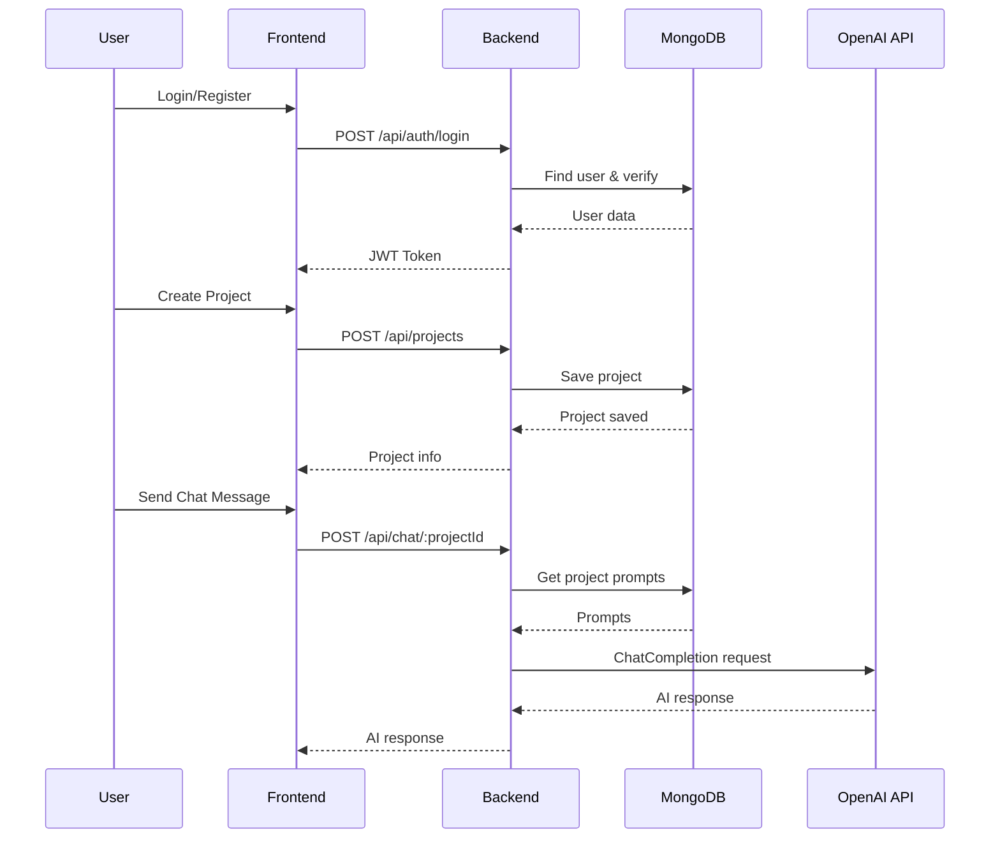

# Architecture & Design Overview

## 1. Components

- **Frontend (React)**
  - Login/Register pages
  - Dashboard to list and create projects
  - Chat interface for user-agent interaction
  - File upload component (optional)

- **Backend (Node.js + Express)**
  - **Auth Module**: JWT-based authentication
  - **User Controller**: Handles user profile
  - **Project Controller**: CRUD operations for projects and prompts
  - **Chat Controller**: Integrates with OpenAI API for responses
  - **File Service**: Uses OpenAI Files API for uploads (good-to-have)

- **Database (MongoDB)**
  - **Users Collection**: Stores user credentials and project references
  - **Projects Collection**: Stores project metadata, prompts, and file references

## 2. Data Flow
1. **Authentication**: User registers/logs in → JWT issued → Stored in client localStorage
2. **Project Management**: Authenticated requests include JWT → Backend verifies token → Performs CRUD on projects
3. **Chat Interaction**:
   - User sends message → Backend retrieves project prompts → Combines message with prompts → Sends to OpenAI → Returns AI response to frontend
4. **File Upload** (Optional): Frontend sends file → Backend forwards to OpenAI Files API → Stores fileId in project record

## 3. Key Design Decisions

- **JWT Authentication**: Stateless, easy to scale with microservices
- **MongoDB**: Flexible schema for storing dynamic prompts and file metadata
- **Modular Codebase**: Separate controllers, services, and routes for maintainability
- **Environment Variables**: Secure handling of API keys and secrets

## 4. Non-Functional Considerations

- **Scalability**: Horizontal scaling of backend instances behind a load balancer
- **Security**: Helmet.js, rate limiting, CORS policies, encrypted JWT
- **Extensibility**: Clear module boundaries allow adding analytics or new LLM services
- **Reliability**: Health check endpoint and centralized error handling

## 5. Sequence Diagram

